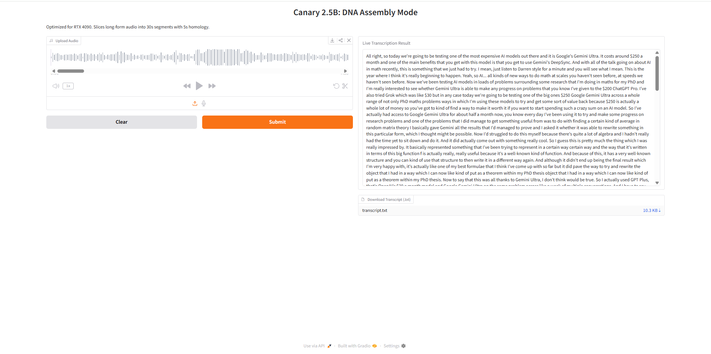

# 🧬 Canary-Qwen-2.5B: DNA-Assembly Long-Form ASR

[](https://www.python.org/)
[](https://www.nvidia.com/en-us/geforce/graphics-cards/40-series/rtx-4090/)
[](https://huggingface.co/nvidia/canary-qwen-2.5b)

A specialized local implementation of NVIDIA's SOTA Automatic Speech
Recognition (ASR) model, optimized for Windows 11.\
This project features a custom **"DNA Assembly"** algorithm to bypass
architectural limits on audio duration.



------------------------------------------------------------------------

## 🤖 AI Agent & Developer Summary

-   **Model Architecture:** Speech-Augmented Language Model (SALM) via
    NVIDIA NeMo `speechlm2`
-   **Primary Innovation:** Overlap-Layout-Consensus (OLC) stitching to
    bypass the 40-second inference window
-   **Hardware Target:** NVIDIA RTX 40-series (Tested on RTX 4090)
-   **Precision:** `bfloat16` for high-throughput Tensor Core
    utilization
-   **Environment:** Windows 11 + Conda + CUDA 12.4

------------------------------------------------------------------------

## 🚀 The Problem & The "DNA" Solution

### The Bottleneck

The **Canary-Qwen-2.5B** model is trained on 40-second audio chunks.
Feeding longer files (e.g., multi-minute recordings) causes the
attention mechanism to degrade, resulting in infinite punctuation loops
(e.g., `,,,,,,,,`).

### The Solution: DNA Assembly Stitching

This project implements an **Overlap-Layout-Consensus (OLC)** strategy:

1.  **Redundant Slicing**\
    Audio is cut into 30s segments with a 5s "homology" overlap.

2.  **Deterministic Decoding**\
    `do_sample=False`\
    `repetition_penalty=1.2`\
    `temperature=0.0`

3.  **Sequence Alignment**\
    Uses the **Levenshtein Distance** algorithm to find the optimal
    junction point between slices, zipping them into a seamless
    transcript without word doubling or mid-word cuts.

------------------------------------------------------------------------

## 🛠️ Installation (Windows 11)

### 1. Prerequisites

-   **Visual Studio Build Tools:** Install "Desktop development with
    C++"
-   **FFmpeg:** Must be available in your System `%PATH%`

### 2. Environment Setup (One-Liner)

Open a CMD (not PowerShell) and run:

``` cmd
conda create -n canary python=3.11 -y && conda activate canary && conda install -c conda-forge pynini=2.1.6 -y && pip install torch torchvision torchaudio --index-url https://download.pytorch.org/whl/cu124 && pip install gradio Cython lhotse pydub python-Levenshtein soundfile && pip install "nemo_toolkit[asr] @ git+https://github.com/NVIDIA/NeMo.git"
```

------------------------------------------------------------------------

## 🏃 Execution

Create `start_canary.bat`:

``` bat
cd /d E:\STT
call conda activate canary
python app.py
pause
```

Or run directly:

``` cmd
conda activate canary && python app.py
```

------------------------------------------------------------------------

## 📊 Technical Specifications

  Feature    Specification
  ---------- ------------------------------------------
  Backbone   Qwen-2.5 (2.5B Parameters)
  VRAM       \~8.5 GB Inference
  Audio      16kHz Mono / Peak Normalized
  Overlap    5000ms Homology Region
  Decoding   repetition_penalty=1.2 / temperature=0.0

------------------------------------------------------------------------

## 📂 Project Structure

    app.py               # Inference engine with OLC stitching logic
    assets/              # Project screenshots and media
    start_canary.bat     # Automated Windows entry point
    .gitignore           # Excludes .nemo weights and audio blobs

------------------------------------------------------------------------

Created for local inference on Windows 11 + RTX 4090.
